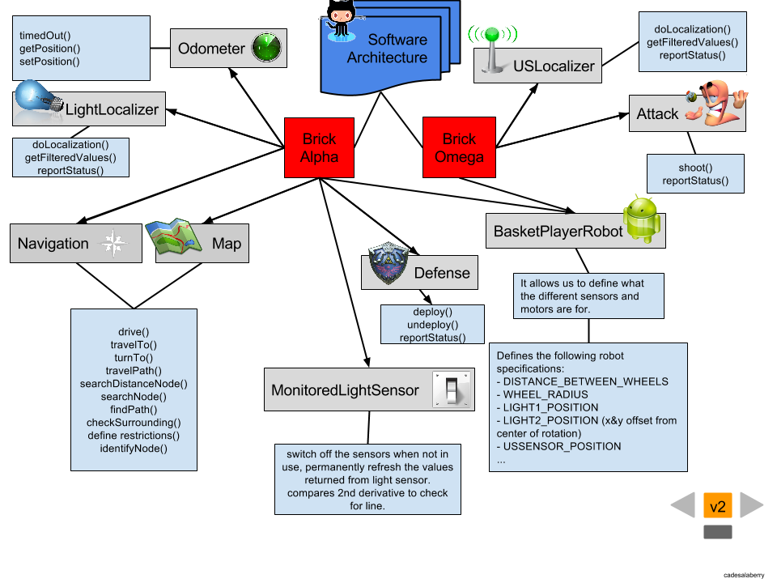
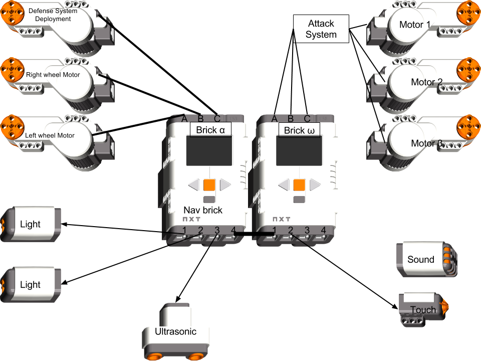

StormChaser
===========

## Software Architecture

## Brick Architecture

# Project Description

The basic task has been described as follows: 

 
Construct an autonomous one-on-one basketball-playing robot capable of navigating about an enclosed field populated with known obstacles placed at restricted locations within the enclosure.

Upon receiving instructions on Bluetooth radio, the robot will assume the role of either a forward or a defender and proceed according to its role. If the role assigned is forward, the robot proceeds to the ball dispenser located at coordinates sent by Bluetooth, retrieves a ball, and then attempts to score on the basket while staying out of the defender’s zone. If the role assigned is defender, the robot moves to the defender zone and attempts to block any shots on the basket. Play proceeds until balls are exhausted or the 10 minute time limit is reached.

## Details

* 1. The dimensions and layout of the field are shown in Figure 1. To facilitate operations, the floor is comprised of nine 4’x4’ hardwood-covered metal panels that lock together. The surface of each panel is marked with a 4’x4’ grid that aligns precisely with adjacent panels. These are intended for navigational purposes, which were covered during one of the one-week labs.

* 2. The field is located within an 8’x10’ area shown in the figure, and surrounded by a band that is 2 tiles wide on the sides, and 1 tile wide on the top and bottom. Gridlines form a coordinate system with the origin in the lower left hand corner as shown.

* 3. The basket is centered at coordinates (5,9) with hoop diameter of 6.0 in. at a height of 12.0 in above the floor.

* 4. In the role of forward, your robot may not exceed a height of 8.0 in, fully extended, while in the role of defender, height is limited to a maximum of 10.0 in.

* 5. The defender zone is located as shown Figure 1, with dimensions w1 and w2 broadcast to each robot on startup. Each parameter is such that [2 ≤ w1,w2 ≤ 4].

* 6. On startup, each robot shall proceed to their respective positions, avoiding collisions with any obstacles or each other. A collision between robots shall signify a false start, and the round restarted up to a maximum of 3 false starts. The defender must stay in the box defined by w1 and w2, while the forward may position itself anywhere in the 8x10 field area, but outside of the defender zone. Any robot wandering outside of their respective areas for more than 10 seconds will receive a penalty of 1 point.

* 7. At the start of each round, both teams will be directed to place their robots in one of the 4 corners show, at a random position and orientation within the corresponding tiles. When executing its localization routine, your robot must always keep the center of rotation within the tile (this implicitly limits the footprint of your robot).

* 8. You will be provided with a Bluetooth class that has methods for retrieving i) the number of your starting corner, your role as either a (F)orward or (D)efender, the defender zone dimensions (w1,w2), and the location/orientation of the ball dispenser (bx,by,Ω). All coordinates are in tile units with the exception of Ω.

* 9. The first two dispenser coordinates, bx, by, refer to the lower left hand corner of the tile in which the dispenser sits. Its orientation, Ω, is specified as an integer {1,2,3,4} corresponding to the cardinal directions N, E, S, W. A detailed drawing of the dispenser and the feeder mechanism will follow this document.

* 10. The competition will be comprised of 3 rounds. In Rounds 1 and 2, each team shall have one round as a defender and one as a forward. Points will be awarded for each basket scored and each shot blocked. Penalties for excessive false starts or wandering outside of the prescribed play areas shall subtract from your total. In the 3rd round, each team will play forward and attempt to score as many baskets as possible within the round. For this round, up to 4 cinder block obstacles will be placed at random in the forward zone. Each round is 10 minutes in length.

* 11. For the purposes of the course, a successful design is one that can successfully localize, correctly assume its position on the field as either a forward or defender, and score at least 1 goal.

* 12. For the competition (which has nothing to do with your final grade), the 3 teams with the most points will be awarded prizes and bragging rights.

* 13. The balls used in this competition are the red and blue balls found in your Mindstorms kit.

* 14. You may use up to 3 Mindstorms kits to fabricate your design. Any other material used must be with the explicit permission of the instructors. Further, any such materials will be posted to an “additional bill of materials” list on WebCT which may then be used by other groups.

* 15. Once both robots have assumed their field positions, the forward must refrain from **any** use of its ultrasonic sensors. Only the defender is allowed to ping upfield. Clarification - note that when the forward acquires balls from the dispenser, it is not considered to be looking upfield, so use of ultrasonics is permitted here.

* 16. To simplify ultrasonic detection, cinderblocks will be replaced by groops of 4 or 6 wooden blocks (the kind in the lab), taped together to approximate the cinderblock form factor.